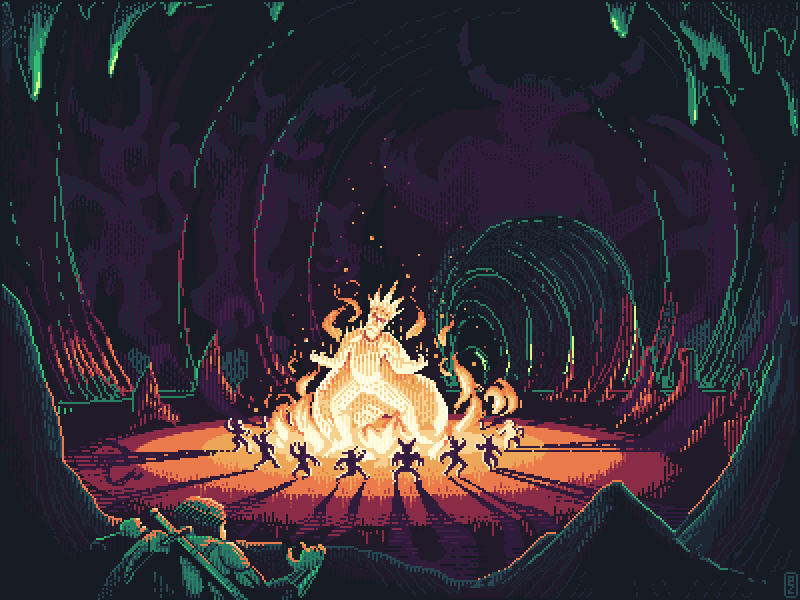

<h1 align="center">
  Ptriniak 
</h1>

  

  

  

  

  

  <a href="#-technologys">🚀 Technologys</a>&nbsp;&nbsp;&nbsp;|&nbsp;&nbsp;&nbsp;
  <a href="#-project">💻 Project</a>&nbsp;&nbsp;&nbsp;|&nbsp;&nbsp;&nbsp;
  <a href="#-how-to-contribute">🤔 How to contribute</a>&nbsp;&nbsp;&nbsp;|&nbsp;&nbsp;&nbsp;
  <a href="#boy-members">👦 Members</a>&nbsp;&nbsp;&nbsp;|&nbsp;&nbsp;&nbsp;
  <a href="#-license">📝 License</a>

 

## 🚀 Technologys

## 💻 Project

  <h3>Game created by the amazing Ptriniaks</h3>
  
Future we will provide more infos about the lore and images of the game.

  
   
  <small>Creds to <a src="https://dribbble.com/pakowacz">Paco</a></small>

## 🤔 How to contribute

- Fork this repository;
- Create a branch with your feature: `git checkout -b my-feature`;
- Commit your changes: `git commit -m 'feat: My new feature'`;
- Push to your branch: `git push origin my-feature`.

After the merge of your pull request is done, you can delete your branch.

### You can also create an issue and send an idea, suggestion or bug!

## :boy: Members

- Cesp
- Firenzee
- Tym
- Xucs
- Sagnos

## 📝 License

This project is under the MIT license. See the [LICENSE](LICENSE) for more details.

---

Made with :coffee: and 🖤 by [Henriquecesp](https://github.com/Henriquecesp) and Ptriniaks :wave:
